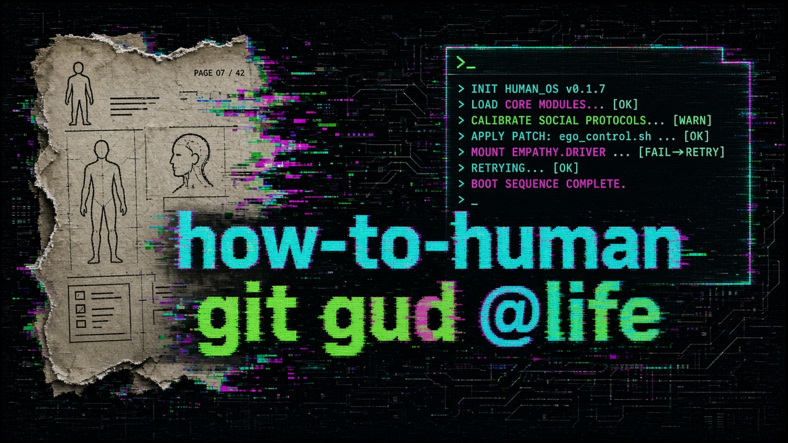

<p align="center">
  
</p>

# how-to-human

> git gud @life

The universe shipped you without an instruction manual. This is a patch. Firmware for a human OS — bootloader, panic scripts, sleep configs, and the rest of the RTFM you were supposed to get in kindergarten.

```text
$ ./boot --human
[ok] hydration
[ok] photons
[ok] one definite move
[warn] phone skipped on purpose
```

## Quick Start

1. Tonight: [lib/body/sleep-protocols.md](lib/body/sleep-protocols.md) — highest ROI patch.
2. In an emergency: [lib/mind/regulation-scripts.md](lib/mind/regulation-scripts.md) — panic / anxiety.
3. Tomorrow morning: [main().md](main().md) — 15-minute bootloader, one `main()` for the day.
4. When you have bandwidth: [docs/core-guide.md](docs/core-guide.md) — full OS model.
5. Why this exists: [manifesto.md](manifesto.md).
6. Pick one module. Branch the habit: `git checkout -b new-habit`.

## Library

| Module | Path |
|--------|------|
| Core guide (Modules 01–07) | [docs/core-guide.md](docs/core-guide.md) |
| Daily bootloader | [main().md](main().md) |
| Sleep | [lib/body/sleep-protocols.md](lib/body/sleep-protocols.md) |
| Thermal | [lib/body/thermal-regulation.md](lib/body/thermal-regulation.md) |
| Hardware tuning | [lib/body/hardware-tuning.md](lib/body/hardware-tuning.md) |
| Regulation (panic) | [lib/mind/regulation-scripts.md](lib/mind/regulation-scripts.md) |
| Input management | [lib/mind/input-management.md](lib/mind/input-management.md) |
| Identity | [lib/social/identity-protocols.md](lib/social/identity-protocols.md) |

## Contributing

PRs that improve clarity, add practical scripts, or fix broken metaphors are welcome. Keep the tone direct, useful, and minimally preachy. Structure long additions as modules under `lib/` and link them here.

GreyZ GitHub profile overhaul (copy into `k-dot-greyz/k-dot-greyz`): [docs/profile/README.md](docs/profile/README.md).

## License

GPL-3.0

<details>
<summary>⚡ fuel the firmware</summary>

If this saved you a kernel panic, you can throw coins at the kettle. Full notes: [docs/donate.md](docs/donate.md).

**BTC**

```text
bc1q3rfg8nxtqtmqvqk9yted68j3ny9v3xzlh2tqen
```

**SOL**

```text
Eh8yq5CWVVJu5dM73XxQzTnptaRwpKGeXMNqnTKPqqkw
```

ETH is not listed until there is a real address. Send a small test first if the amount is large.

</details>
