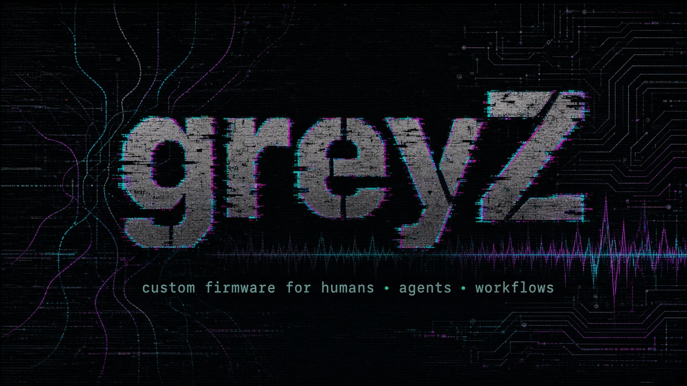

<!--
Install this as your GitHub profile:
1. Create a public repo named exactly k-dot-greyz (https://github.com/k-dot-greyz/k-dot-greyz).
2. Copy this README to that repo root.
3. Copy assets/banners/greyz-profile-banner.png into that repo (or keep the relative path below if you vendor docs/profile + assets together).
4. Paste BIO.md into Profile → Bio (160 char limit).
5. Pin: how-to-human, zenOS, glitch-that-shit, neuro-spicy-devkit, GlitchLab, copilot-cockpit.
Location field (optional): auditing your company's workflow upon request
-->

<p align="center">
  
</p>

# greyZ

```text
kaspars@greyz:~$ whoami
operator · alchemist · music / audio / workflow engineer
status:   everything is in active development at all times
mission:  write the missing instruction manuals
```

**The universe shipped you without a manual.** I write patches — for humans, agents, and the glitch in between.

RTFM. Then fork it.

## Now playing

| Repo | One-liner |
|------|-----------|
| [how-to-human](https://github.com/k-dot-greyz/how-to-human) | Instruction manual for being a person. `git gud @life`. |
| [zenOS](https://github.com/k-dot-greyz/zenOS) | Human–agent OS. Dex, swarms, living procedures. |
| [glitch-that-shit](https://github.com/k-dot-greyz/glitch-that-shit) | Browser extension that glitches ads and junk out of the viewport. |
| [neuro-spicy-devkit](https://github.com/k-dot-greyz/neuro-spicy-devkit) | ADHD/autism-friendly portable dev environment. |
| [GlitchLab](https://github.com/k-dot-greyz/GlitchLab) | Pixel-sort / displacement / WebGL glitch art. |
| [copilot-cockpit](https://github.com/k-dot-greyz/copilot-cockpit) | Agent-surface dashboard for the GlitchWorks / zenOS workflow. |

## Current firmware

- **GlitchWorks** — artist-sovereign, GDPR-native, Estonian-law shaped holding pattern.
- **MID-OS / dex** — protocols, procedures, and MIDI-ish packet discipline for agents and humans.
- **Audio + workflows** — if it makes sound or moves a ticket, I will try to route it.

```text
$ ./boot --human
[ok] hydration
[ok] photons
[ok] one definite move
[warn] social media skipped on purpose
```

Need the human bootloader? Start at [how-to-human](https://github.com/k-dot-greyz/how-to-human).

<details>
<summary>⚡ fuel the firmware</summary>

Handy wallets live with the manual so they stay in one place:

- **BTC:** `bc1q3rfg8nxtqtmqvqk9yted68j3ny9v3xzlh2tqen`
- **SOL:** `Eh8yq5CWVVJu5dM73XxQzTnptaRwpKGeXMNqnTKPqqkw`
- Full notes: [how-to-human / docs/donate.md](https://github.com/k-dot-greyz/how-to-human/blob/main/docs/donate.md)

Send a small test first if the amount is large. No ETH until a real address is published.

</details>
